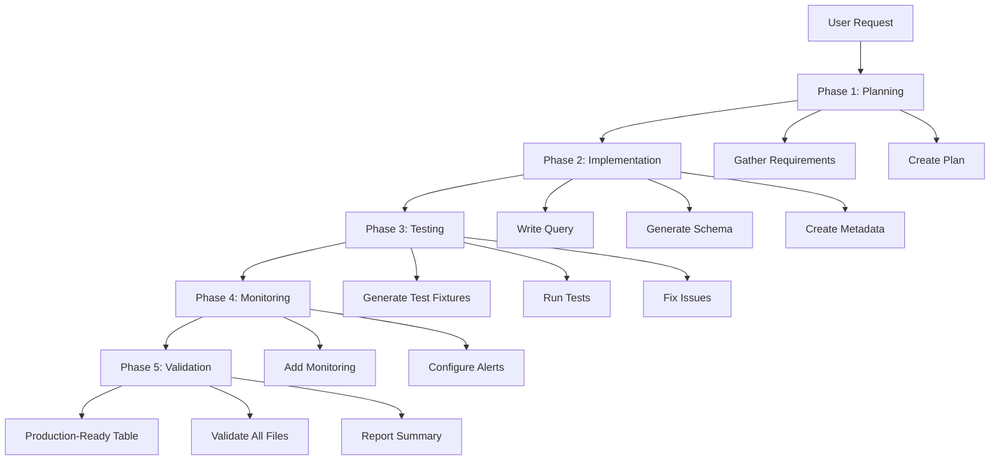

# Available Agents

Agents are autonomous assistants that coordinate multiple skills to accomplish complex tasks end-to-end.

Below are the currently available agents:

## ETL Orchestrator

### Overview

| Property | Value |
|----------|-------|
| **Name** | `etl-orchestrator` |
| **Purpose** | Builds complete BigQuery data models from requirements through testing and monitoring |
| **Skills Used** | bigquery-etl-core, model-requirements, query-writer, metadata-manager, sql-test-generator, bigconfig-generator |
| **Autonomy Level** | High - makes implementation decisions autonomously |

### When to Use

Use the ETL orchestrator when you need:

- **Complete table implementation**: "Build a new table for user retention metrics"
- **End-to-end workflows**: "Implement this data model with tests and monitoring"
- **Complex multi-step tasks**: "Create a derived table that aggregates events by user"
- **Production-ready deliverables**: Tasks requiring full documentation and testing

### What It Does

The orchestrator executes a complete ETL workflow:



### Example Invocations

```bash
# Create a new derived table
"Build a new table called user_retention_daily that calculates
7-day rolling retention from events_daily"

# Implement with full testing
"Implement a derived table for client attribution with proper
tests and monitoring"

# Complex aggregation
"Create a new aggregate table for search metrics with incremental
updates and data quality checks"
```

### What You Get

Upon completion, the agent delivers:

```
sql/{project}/{dataset}/{table_name}/
├── query.sql OR query.py     # Query implementation
├── metadata.yaml              # Scheduling and ownership
├── schema.yaml                # Schema with descriptions
├── tests/                     # Test directory
│   ├── test_{table_name}/    # Test fixtures
│   │   ├── source1.yaml
│   │   ├── source2.yaml
│   │   └── ...
│   └── expect.yaml           # Expected output
└── bigconfig.yml             # Monitoring config (if applicable)
```

All files:
- ✅ Properly formatted per Mozilla conventions
- ✅ Fully documented with descriptions
- ✅ Tested and validated
- ✅ Ready for code review and deployment

### Error Handling

The orchestrator handles common errors autonomously:

| Error Type | Agent Response |
|------------|----------------|
| **Query errors** | Analyzes error, revises query, retries |
| **Test failures** | Diagnoses mismatch, updates schema/fixtures, reruns |
| **Schema mismatches** | Regenerates schema from query output |
| **Missing dependencies** | Documents missing sources, suggests resolution |
| **Formatting issues** | Applies Mozilla formatting conventions |

### Transparency

The agent reports progress at each phase:

- What it's doing and why
- Which skills it's invoking
- Decisions being made
- Issues encountered and how they were fixed
- Summary of what was created

### When NOT to Use

Don't use the orchestrator for:

- ❌ Simple query updates (use `query-writer` skill instead)
- ❌ Just adding tests (use `sql-test-generator` skill)
- ❌ Only schema changes (use `metadata-manager` skill)
- ❌ Quick fixes or single-file edits

For single-task work, use the relevant skill directly - it's faster.

## Future Agents

As the plugin evolves, additional specialized agents may be added for:

- **Schema migration**: Safely migrate schemas and update dependent code
- **Data quality monitoring**: Analyze tables and add comprehensive monitoring
- **Query optimization**: Analyze and optimize existing queries for performance
- **Documentation generator**: Generate comprehensive documentation for datasets

See [Creating Agents](creating-agents.md) to learn how to build new agents.

## Quick Links

<div class="grid cards" markdown>

- :material-robot-outline: **[Agents Overview](overview.md)**

    Understand how agents work

- :material-hammer-wrench: **[Creating Agents](creating-agents.md)**

    Build your own agents

- :material-cog: **[Available Skills](../skills/available-skills.md)**

    Skills that agents can use

</div>
