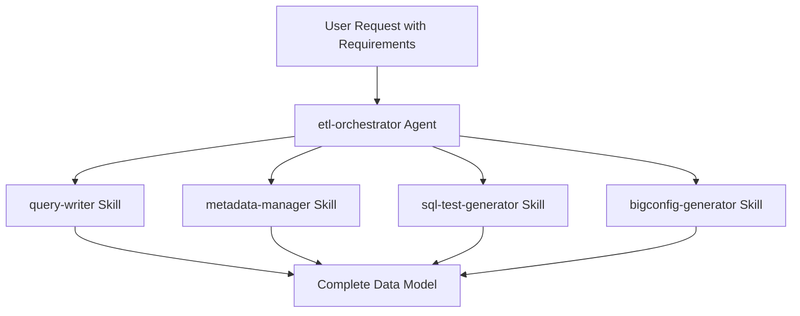

# Agents Overview

Agents are autonomous AI assistants that coordinate multiple skills to accomplish complex, multi-step tasks. Unlike skills which are instruction sets for specific tasks, agents make decisions, handle errors, and work iteratively to achieve high-level goals.

## What Are Agents?

**Agents** are specialized [Claude Code subagents](https://code.claude.com/docs/en/sub-agents) that:

- **Operate autonomously**: Make decisions about how to accomplish goals
- **Coordinate skills**: Invoke multiple skills in sequence to complete workflows
- **Handle errors**: Detect issues, diagnose problems, and fix them without user intervention
- **Work iteratively**: Refine and improve outputs through multiple passes
- **Report progress**: Keep you informed about what they're doing and why

## Agents vs Skills

Agents differ from skills in their autonomy, scope, and purpose. While skills provide instructions for specific tasks, agents orchestrate multiple skills to accomplish complex workflows.

!!! tip "Detailed Comparison"
    See the [Skills vs Agents guide](../getting-started/skills-vs-agents.md) for a comprehensive comparison, decision tree, and detailed scenarios to help you choose the right approach.

## How Agents Work

### Anatomy of an Agent

Each agent is a markdown file in the `agents/` directory with YAML frontmatter:

```markdown
---
name: agent-name
description: What this agent does and when Claude should invoke it
skills: skill1, skill2, skill3
model: sonnet
---

# Agent Name

Detailed description of what the agent does...

## When to Use This Agent
...

## How It Works
...
```

### Key Agent Fields

| Field | Purpose |
|-------|---------|
| `name` | Unique identifier (lowercase, hyphens) |
| `description` | What it does + when to use it (for discovery) |
| `skills` | Comma-separated skills to auto-load |
| `model` | Model to use: `sonnet`, `opus`, or `haiku` |

### Agent Lifecycle

1. **Invocation**: User requests a task that matches agent description
2. **Planning**: Agent analyzes requirements and creates implementation plan
3. **Skill Coordination**: Agent invokes relevant skills in sequence
4. **Validation**: Agent checks outputs and fixes issues
5. **Iteration**: Agent refines until production-ready
6. **Completion**: Agent reports what was created

### Skill Coordination

Agents access skills defined in their `skills:` frontmatter field:

```markdown
---
name: etl-orchestrator
skills: bigquery-etl-core, query-writer, metadata-manager, sql-test-generator, bigconfig-generator
---
```

These skills are automatically loaded when the agent starts, allowing the agent to invoke them as needed.

## Agent Architecture Benefits

### Composability

Agents leverage existing skills rather than duplicating logic:



### Reusability

Skills remain usable both:

- **Directly**: Claude invokes them for specific tasks
- **Via Agents**: Agents coordinate them for complex workflows

### Maintainability

- **Skills**: Focus on single-task instructions and patterns
- **Agents**: Focus on orchestration and error handling
- **Separation**: Changes to agent logic don't affect skills

## Error Handling

Agents handle errors autonomously through:

1. **Detection**: Identifying when something fails (test failure, validation error)
2. **Diagnosis**: Understanding what went wrong
3. **Correction**: Fixing the issue
4. **Retry**: Re-running the failed step
5. **Escalation**: Asking user if autonomous fixes don't work

### Example Error Flow

```
Agent creates query → Generates tests → Runs tests → Test fails
    ↓
Agent analyzes failure → Identifies schema mismatch
    ↓
Agent updates schema.yaml → Regenerates tests → Runs tests → Success
```

## Transparency

Agents report their work transparently:

```markdown
Phase 1: Planning
✓ Loaded bigquery-etl-core for conventions
✓ Validated requirements are sufficient
✓ Created implementation plan

Phase 2: Implementation
✓ Invoked query-writer to create query.sql
✓ Query uses incremental partitioning
✓ Invoked metadata-manager for schema
✓ Generated 15 field descriptions

Phase 3: Testing
✓ Invoked sql-test-generator
✓ Created 3 input fixtures
✓ Generated expected output
✗ Test failed: column mismatch

Phase 3 (retry): Testing
✓ Updated schema to match query output
✓ Regenerated test fixtures
✓ All tests passing

Phase 4: Monitoring
✓ Invoked bigconfig-generator
✓ Added freshness check (24h threshold)
✓ Added volume anomaly detection

Complete! Created:
- sql/moz-fx-data-shared-prod/telemetry_derived/user_retention_v1/query.sql
- sql/moz-fx-data-shared-prod/telemetry_derived/user_retention_v1/metadata.yaml
- sql/moz-fx-data-shared-prod/telemetry_derived/user_retention_v1/schema.yaml
- sql/moz-fx-data-shared-prod/telemetry_derived/user_retention_v1/tests/...
- sql/moz-fx-data-shared-prod/telemetry_derived/user_retention_v1/bigconfig.yml
```

## Autonomy Levels

Agents can operate at different autonomy levels:

| Level | Description | User Interaction |
|-------|-------------|------------------|
| **High** | Agent makes all decisions | Minimal - only for ambiguous requirements |
| **Medium** | Agent handles implementation, asks about approach | Occasional - for architectural choices |
| **Low** | Agent confirms each step | Frequent - for validation |

The `etl-orchestrator` agent operates at **high autonomy**, only asking questions when requirements are unclear.

## Quick Links

<div class="grid cards" markdown>

- :material-robot: **[Available Agents](available-agents.md)**

    See all agents in the plugin

- :material-hammer-wrench: **[Creating Agents](creating-agents.md)**

    Learn how to build new agents

- :material-thought-bubble: **[Skills vs Agents](../getting-started/skills-vs-agents.md)**

    Detailed comparison and decision guide

</div>
