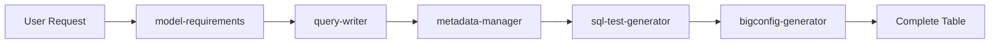
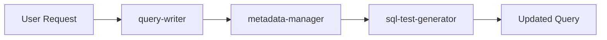

# Available Skills

This plugin provides 7 specialized skills for BigQuery ETL workflows. Skills are automatically invoked by Claude based on your requests - you don't need to call them explicitly.

## Skill Categories

### Foundation

| Skill | Purpose | Claude uses when |
|-------|---------|-------------|
| bigquery-etl-core | Project conventions and patterns | Checking naming conventions, understanding project structure |

### Construction Workflows

| Skill | Purpose | Claude uses when |
|-------|---------|-------------|
| model-requirements | Requirements gathering | Planning new tables or understanding existing ones |
| query-writer | SQL/Python query writing | Creating or updating query.sql, query.py files or ad-hoc queries |
| metadata-manager | Schema and metadata config | Generating schema.yaml & metadata.yaml files with descriptions |
| sql-test-generator | Unit test generation | Creating, updating, and running unit tests |
| bigconfig-generator | Data quality monitoring | Adding Bigeye monitoring configurations |

### Meta Skills

| Skill | Purpose | Claude uses when |
|-------|---------|-------------|
| skill-creator | Create new skills | Extending the plugin with new capabilities |

## How Skills Work Together

Skills are designed to be composable—they work together to complete complex workflows:

### Example: Creating a New Table

1. **model-requirements** gathers requirements
2. **query-writer** creates the SQL
3. **metadata-manager** generates schema/metadata
4. **sql-test-generator** creates tests
5. **bigconfig-generator** adds monitoring

### Example: Updating a Query

1. **query-writer** updates the query
2. **metadata-manager** updates the schema
3. **sql-test-generator** updates tests

See the [Skills Overview](overview.md) for detailed information about skill anatomy and coordination.

## Quick Links

- :material-download: **[Installation Guide](getting-started/installation.md)**

    Get up and running in minutes

- :material-lightning-bolt: **[Quick Start](getting-started/quick-start.md)**

    Jump right in with practical examples

